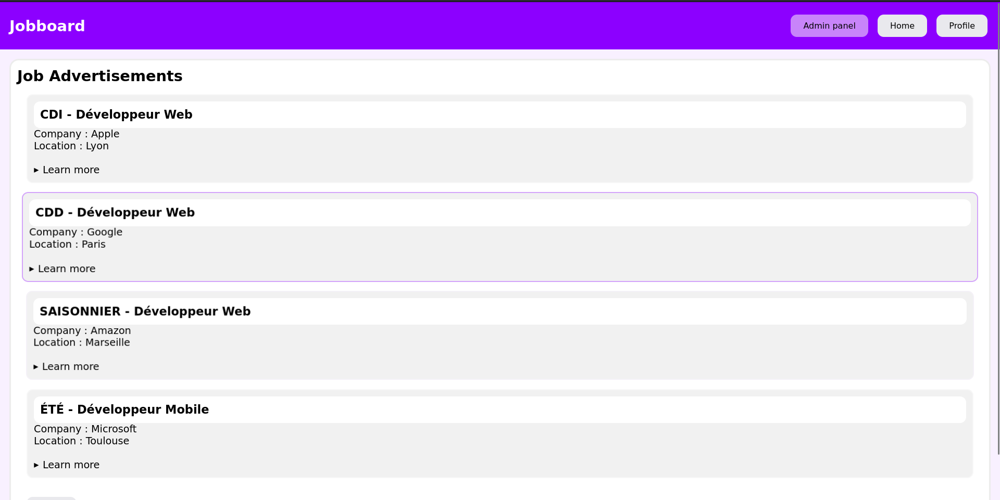
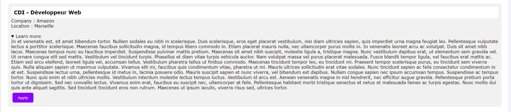
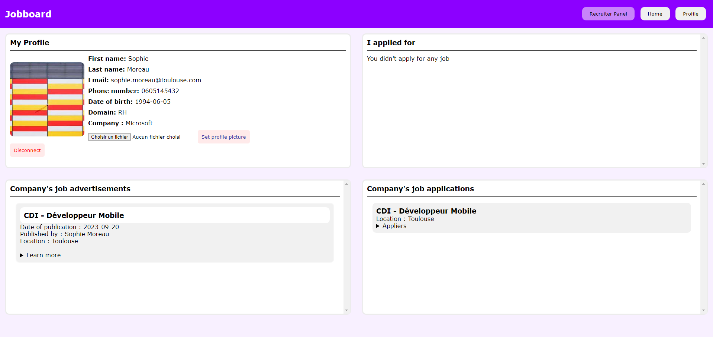
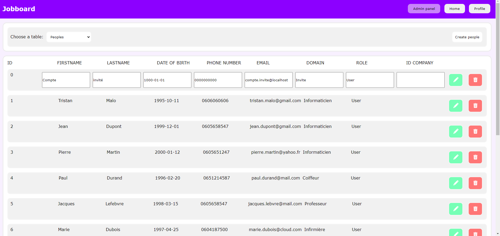

# JobBoard 💼

## Introduction 📖
This project aims to realise a web site listing some job advertisements.
To make this possible, we needed to realise the following steps :
- Create a database (that will contains : job advertisements/applications, users, company...)
- Create some web pages
- Create an API 

The main task is to make all the previous tasks communicate together.









<br>You can see above the display of our main page 'Home', 'Recruiter Profile', 'Admin Panel', 'Job advertisement'.<br>

## Technologies 💯

The technologies used on our project are :
- Front-end : **[Svelte](https://svelte.dev/)**
- Back-end : **[Django](https://www.django-rest-framework.org/)**
- Database : **PostgreSQL / [PgAdmin](https://www.pgadmin.org/)**

## Steps to install 📝
⚠️ **Dependencies** ⚠️<br>
Make sure you have a version of python(¹) >= 3.9.2, you can check it with : 
```bash
python3 -v
```
<br>
You will need also a virtual environnement with python(²), you can check it with <br>

```bash
python3 -m venv -h
```


(¹) If you want to install python 3.9.x, `sudo apt-get install python3.9`.<br>
(²) If you want to install virtual env with python, `sudo apt-get install python3-venv`.<br>

👍🏼 Once you check you have `python3.9` and `python3-venv`, you can follow the steps below : 👍🏼<br>

- **Step 1 :**<br>
Once you have clone the repositorie and you're in the root folder, enter the following command to create a virtual environnement : 
```bash
python3 -m venv env
```
A new folder must be appear, named `env`. <br><br>

- **Step 2 :**<br>
Now, you will enter in the virtual environnement by running : 
```bash
source env/bin/activate
```
<br>
Once you run the command above, your terminal prompt should be :

```bash
(env) username@my_debian: ~/T-WEB501-TLS_6-main$
``` 
<br><br>

- **Step 3:**<br>
Once you are in the virtual env, you can run a script to install all dependencies for you. You can run the script name _install_dependencies.sh_.<br>
➡️➡️➡️<font color="red"> _Make sure to read the script before execute it !_ </font> ⬅️⬅️⬅️

```bash
bash install_dependencies.sh
```

Now, you need to exit the virtual environnement with : 

```bash
deactivate
```
<br>

Update the environnement of your terminal to get all the new dependencies installed before. Run : 

```bash
exec bash
```
<br>

You can run again :

```bash
source env/bin/activate
```
to re-enter in your virtual environnement.<br><br>
- **Step 4 :**<br>
Here, you will need to install _NVM_ for _Svelte_, you can run the following commands :<br>

```bash
cd Frontend/jobboard
nvm install 19.0.0
npm install
```
<br><br>

- **Step 5 :**<br>
Once you realised all the previous steps, you can run the script to launch all the servers : ***Django*** & ***Svelte***.
A script was realase for this, just run : <br>

```bash
cd ../..
python3 launch-servers.py
```
<br><br>
- **Step 6:**<br>
Open your browser with the url : `http://localhost:5173`.<br><br><br>
➡️ Make sure to always be in the virtual environnement ⬅️<br>

## Contributors 💪 
**- Nathan DULAC** <br>
- [Github](https://github.com/Torahime3)
- [Linkedin](https://www.linkedin.com/in/nathan-dulac-2aa654257/)<br>

**- Ariirau FUCKS** <br>
- [Github](https://github.com/AriirauF)
- [Linkedin](https://www.linkedin.com/in/ariirau-fucks-9234a226b/)<br>

## Trello 💼
**[Trello JobBoard](https://trello.com/b/ntRaxyAX/jobboard)**
